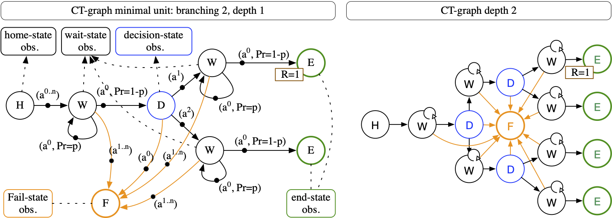
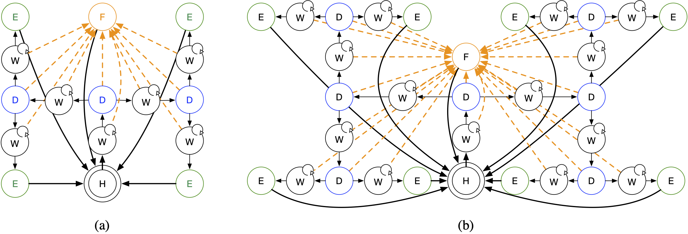

<H1>The configurable tree graph (CT-graph): measurable problems in partially observable and distal reward environments for lifelong reinforcement learning</H1>

Copyright (C) 2019-2023 Andrea Soltoggio, Pawel Ladosz, Eseoghene Ben-Iwhiwhu, Jeff Dick, Christos Peridis, Saptarshi Nath.

The CT-graph is a benchmark for deep RL build on an exponentially growing tree graph. It can be configured to any arbitrary high complexity to test the limit of and break any deep RL algorithm with exact measurability of the search space, reward sparsity and other properties.

<b>Objectives</b>

The CT-graph is designed to assess the following RL learning properties:
<ul>
<li>learning with variable and measurable degrees of partial observability;
<li>learning action sequences of adjustable length and increasing memory
requirements;
<li>learning with adjustable and measurable sparsity of rewards;
<li>learning multiple tasks and testing speed of adaptation (lifelong learning scenarios);
<li>learning multiple tasks where the knowledge of task similarity is a
required metrics (meta-learning or multi-task learning);
<li>learning hierarchical knowledge representation and skill-reuse for fast
adaptation to dynamics rewards (lifelong learning scenarios);
<li>testing attention mechanisms to identify key states from noise or con-
founding states;
<li>testing meta-learning approaches for optimised exploration policies;
<li>learning a model of the environment;
<li>learning a combination of innate and learned knowledge to cope with
invariant and variant aspects of the environment.
</ul>

<b>Publications</b>

The CT-graph has been used as a simulation tool in the following papers:

<ul>
          <li>Nath, Saptarshi, Christos Peridis, Eseoghene Ben-Iwhiwhu, Xinran Liu, Shirin Dora, Cong Liu, Soheil Kolouri, and Andrea Soltoggio (2023) "Sharing Lifelong Reinforcement Learning Knowledge via Modulating Masks." Second Conference on Lifelong Learning Agents (CoLLAs). <a href="https://arxiv.org/abs/2305.10997">arXiv preprint arXiv:2305.10997<a> .
          <li>Ben-Iwhiwhu, E., Nath, S., Pilly, P. K., Kolouri, S., & Soltoggio, A. (2022). Lifelong Reinforcement Learning with Modulating Masks. <a href="https://arxiv.org/abs/2212.11110">arXiv preprint arXiv:2212.11110.</a>
          <li>Ben-Iwhiwhu, E., Dick, J., Ketz, N. A., Pilly, P. K., & Soltoggio, A. (2022). Context meta-reinforcement learning via neuromodulation. Neural Networks, 152, 70-79. <a href="https://arxiv.org/abs/2111.00134">arXiv preprint</a>
<li>Ladosz, Pawel et al., "Deep Reinforcement Learning With Modulated Hebbian Plus Q-Network Architecture," in IEEE Transactions on Neural Networks and Learning Systems, doi: 10.1109/TNNLS.2021.3110281. <a href="https://arxiv.org/abs/1909.09902">arXiv preprint</a>
<li>Dick, Jeffery et al. “Detecting Changes and Avoiding Catastrophic Forgetting in Dynamic Partially Observable Environments.” Frontiers in neurorobotics vol. 14 578675. 23 Dec. 2020, doi:10.3389/fnbot.2020.578675         
<li>Ben-Iwhiwhu, Eseoghene, et al. "Evolving inborn knowledge for fast adaptation in dynamic POMDP problems." Proceedings of the 2020 Genetic and Evolutionary Computation Conference. 2020. <a href="https://arxiv.org/abs/2004.12846">arXiv preprint</a>
</ul>

<b>The CT-graph paper</b>

Soltoggio, Andrea, Eseoghene Ben-Iwhiwhu, Christos Peridis, Pawel Ladosz, Jeffery Dick, Praveen K. Pilly, and Soheil Kolouri. "The configurable tree graph (CT-graph): measurable problems in partially observable and distal reward environments for lifelong reinforcement learning." arXiv preprint arXiv:2302.10887 (2023). <a href="https://arxiv.org/abs/2302.10887">https://arxiv.org/abs/2302.10887</a>

<pre>
@article{soltoggio2023configurable,
  title={The configurable tree graph (CT-graph): measurable problems in partially observable and distal reward environments for lifelong reinforcement learning},
  author={Soltoggio, Andrea and Ben-Iwhiwhu, Eseoghene and Peridis, Christos and Ladosz, Pawel and Dick, Jeffery and Pilly, Praveen K and Kolouri, Soheil},
  journal={arXiv preprint arXiv:2302.10887},
  year={2023}
}
</pre>

<b>Installation</b>

pip install -e .

<b>Instructions</b>

Files:

- gym_CTgraph: folder with the CT-graph code.

- test_graph.py: script to the perform basic tests of the CT-graph environments.

- testDimRed.py: script to perform checks on the input image dataset, e.g. dimensionality reduction and visualization with t-SNE.

- ilearn.py: simple script to perform classification on the input image dataset.

Using tensorboad:
tensorboard --logdir='./logs' --port=6707

<b>Graphical representation of depth 1 and depth 2</b> 

<b> Example of two CT-graphs with depth 2 and 3</b> 

<b>Acknowledgement</b>

This material is based upon work supported by the United States Air Force Research Laboratory (AFRL) and Defense Advanced Research Projects Agency (DARPA) under Contract No. FA8750-18-C-0103 (L2M: Lifelong Learning Machines) and Contract No. HR00112190132 (ShELL: Shared Experience Lifelong Learning)

Any opinions, findings and conclusions or recommendations expressed in this material are those of the author(s) and do not necessarily reflect the views of the United States Air Force Research Laboratory (AFRL) and Defense Advanced Research Projects Agency (DARPA).

<b>License</b>

This program is free software: you can redistribute it and/or modify it under the terms of the GNU General Public License as published by the Free Software Foundation, either version 3 of the License, or (at your option) any later version.

This program is distributed in the hope that it will be useful, but WITHOUT ANY WARRANTY; without even the implied warranty of MERCHANTABILITY or FITNESS FOR A PARTICULAR PURPOSE.  See the GNU General Public License for more details.

You should have received a copy of the GNU General Public License along with this program.  If not, see <https://www.gnu.org/licenses/>.
